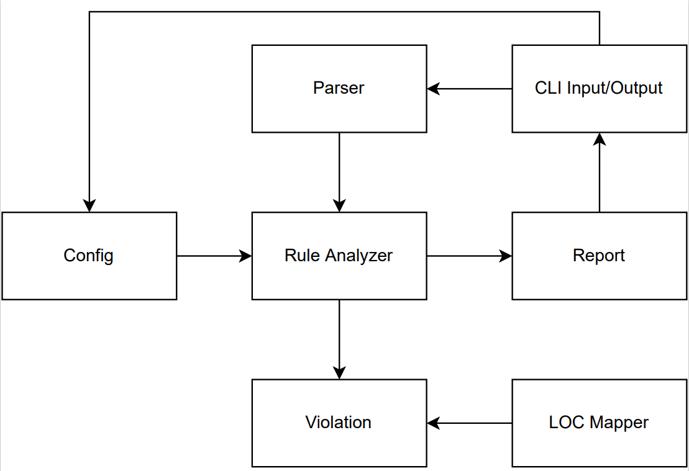
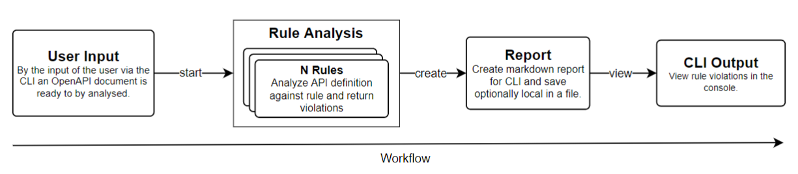

# Architecture and Development Guide
> Here, the architecture of this tool and the plugins used are explained.

## General Architecture

The architecture of this tool is quite simple. We have a total of 8 major components, each of which is responsible for a specific task.

### CLI Input/Output

This component serves as an interface to the user. It asks for user input, such as a path to an OpenAPI document, as well as provides the output of a report file.

### REST Analyzer

This module is the core element of the CLI. Here, the parsed OpenAPI object is passed to the active rules and is analyzed. Information about the status of the rule is received from the Config component. If a violation occurs during the analysis, information is given to the Violation component, which returns a Violation object. After a successful analysis, the collected violation objects are passed to the Report module.

The file/files responsable for this can be found at [Analyzer](../src/main/java/cli/analyzer).

### Parser

This component is responsible for parsing the input. As the core of this component we have the Swagger parser library, which can read OpenAPI definition via URLs or JSON/YAML files directly and facilitates access to the data through already defined methods. It does not matter if the OpenAPI definition is in version 2.0, because it is first converted to a comparable OpenAPI 3.0 definition. After the parsing process is complete, a cleanup process is also performed on the resulting data. Since we do not need all the data, we filter out the data that is not needed for the violations.

This component is used in each rule implementation to parse the input file. Take a look, for example, to the [Hyphens Rule](../src/main/java/cli/rule/rules/HyphensRule.java) to have a better overview.

### Violation

This module is designed to provide a unified rule violation. As input it gets information
from the Rule Analyzer component and returns a Violation object. This contains: the rule object,
the path of the violation, the line where the violation occurred, a description of the rule, and a improvement suggestion.

The file/files responsable for this can be found at [Violation](../src/main/java/cli/rule).

### LOC Mapper

To provide the user with a better feed-back on the location of the violation found, with respect
to a path, some form of localization is required. For this purpose, each path in an OpenAPI definition is mapped to a line of code. All this is implemented by the LOC Mapper component, which takes an OpenAPI definition JSON or YAML as input and then performs a mapping process between the paths and the location in the file.

The file/files responsable for this can be found at [LOC Mapper](../src/main/java/cli/analyzer).

### Report

This component creates two different type of reports. The first one is a Markdown file that is
saved locally in the same folder where the analysis was performed. The second is a summary report that shows the user basic information about the detected violations and is displayed directly in the CLI. The information required to create a report comes from the Rule Analyzer component.

The file/files responsable for this can be found at [Report](../src/main/java/cli/report).

### Config

This module is responsible for the overall configuration of the CLI. The configuration includes
the selection of the active rules to be analyzed and the security scheme by the user input. This configuration is then used by the Rule Analyzer and CLI Input/Output component.

The file/files responsable for this can be found at [Config](../src/main/java/cli/utility).

## Workflow

The following diagram is used to explain the overflow of the entire tool. 

First, the user invokes the CLI with configuration such as the path or URI to an OpenAPI document. In the next step, this document is passed on to the analysis component, where the file is processed and the document is examined against the implemented design rules. Currently, we have implemented a total of 14 rules (see [Rule Implementations](#rule-implementations)). Each rule can return violations, which are passed on to the next component after the rules have been analyzed. In this report component, either a Markdown report is created from the information of the rule violations or the report is displayed directly in the command line in a shortened form. The report contains the path and the line in the OpenAPI document that contains a violation and which rule was violated. A longer version can be saved locally, with additional properties about the violated rule, as well as a suggestion for improvement.

## Rule Implementations

A good overview of the implemented rules can be found [here](./rules/README.md). Additionally, [this folder](./rules/implemented-rules/) contains more detailed documents about every implemented rule, e.g., how the rule was implemented, what was checked, and what can be done to further improve this rule.

## Libraries

### Micronaut 3.5.2 Documentation

- [User Guide](https://docs.micronaut.io/3.5.2/guide/index.html)
- [API Reference](https://docs.micronaut.io/3.5.2/api/index.html)
- [Configuration Reference](https://docs.micronaut.io/3.5.2/guide/configurationreference.html)
- [Micronaut Guides](https://guides.micronaut.io/index.html)

### Gradle

- [Shadow Gradle Plugin](https://plugins.gradle.org/plugin/com.github.johnrengelman.shadow)

### Swagger Parser

- [SwaggerParser](https://github.com/swagger-api/swagger-parser)
- [Swagger](https://swagger.io)

### Picocli

- [Picocli](https://picocli.info)
- [Picocli Repository](https://github.com/remkop/picocli)

## Apache OpenNLP
- [Apache OpenNLP](https://opennlp.apache.org)
- [Model](src/main/resources/models/en-pos-maxent.bin)

## Weka

- [Weka](https://www.cs.waikato.ac.nz/ml/weka/)
- [Model](src/main/resources/models/request_model.dat)
